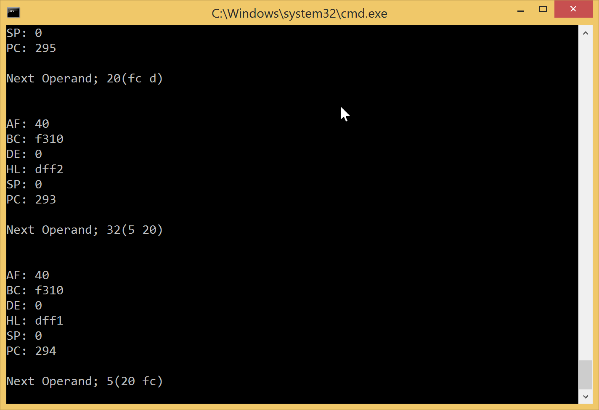
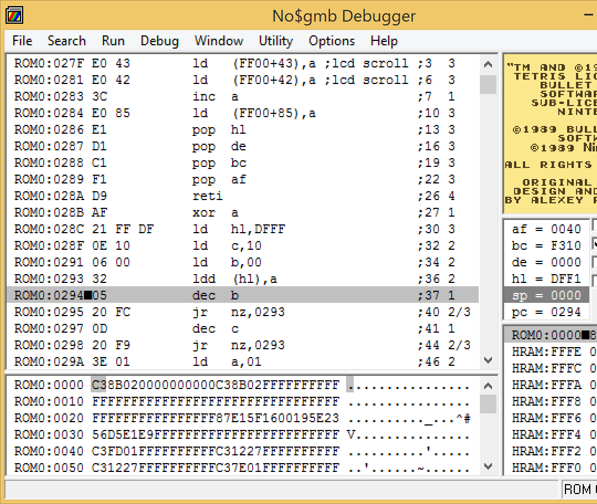

# AO-Gameboy

AO-Gameboy is an emulator for the original gameboy. While incomplete it is the largest project I've worked on to date.

## Building

Originally I was using a makefile to build from the command line. THe library dependency of SFML for graphics complicated things and I switched to using Visual Studio. To build you will need to add all files to a Visual Studio project and add SFML to the project.

Once I complete the project I will probably create makefiles for building on OSX, Linux and (if possible) Windows.

## Progress

Currently the CPU is complete. The fetch-execute-decode cycle works. 

Ensuring that instructions are executed correctly has posed some issues. To debug I created my own debugger that let me step through the program and show me the data in the registers after each instruction. I compared these against values from the no$GMB debugger and verified that they were the same. I fixed bugs as in the ALU as I came across them.

Timing is more or less accurate with the original gameboy. 

I've added a GPU but it's currently buggy and does not work. Interrupts have been implemented but not tested. Sound is the least essential feature and will be the last to be implemented.

